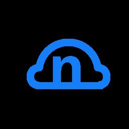

# nCloud: Nintendo Switch Homebrew Nextcloud Client

nCloud is a closed-source homebrew Nextcloud client for the Nintendo Switch that allows Switch users to browse, download, upload and install files to/from a remote Nextcloud instance.

## Features

- Browse remote Nextcloud files
- Download files
- Upload files from SD card
- Install `.nsp` & `.xci` files

## No Warranty and Limitation of Liability

**THE SOFTWARE IS PROVIDED "AS IS" WITHOUT WARRANTY OF ANY KIND, EXPRESS OR IMPLIED, INCLUDING BUT NOT LIMITED TO THE WARRANTIES OF MERCHANTABILITY, FITNESS FOR A PARTICULAR PURPOSE, AND NONINFRINGEMENT. IN NO EVENT SHALL THE AUTHORS OR COPYRIGHT HOLDERS BE LIABLE FOR ANY CLAIM, DAMAGES, OR OTHER LIABILITY, WHETHER IN AN ACTION OF CONTRACT, TORT, OR OTHERWISE, ARISING FROM, OUT OF, OR IN CONNECTION WITH THE SOFTWARE OR THE USE OR OTHER DEALINGS IN THE SOFTWARE.**

**I AM NOT RESPONSIBLE FOR ANYTHING THAT HAPPENS AS A RESULT OF USING THIS DOFTWARE, INCLUDING BRICKED OR BANNED CONSOLES!!! USE AT YOUR OWN RISK!!!**
