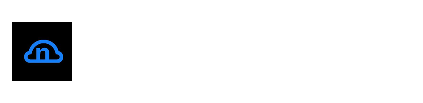

# nCloud — Nintendo Switch Homebrew Nextcloud Client (NSP/XCI Installer)

**nCloud** is a homebrew [Nextcloud](https://nextcloud.com/) client for the **Nintendo Switch**. It lets you browse, download, upload, and install files directly to your Switch from your own self-hosted Nextcloud server — a private, cloud-based alternative to sideloading over USB or copying files back and forth from your SD card.

If you run custom firmware (CFW) such as **Atmosphère** and want to manage your files and install `.nsp` / `.xci` packages straight from your own cloud storage, nCloud is built for you.

> ⚠️ nCloud is a closed-source homebrew application. See the disclaimer below — **use at your own risk.**

## Features

- 📂 Browse remote Nextcloud files and folders from your Switch
- ⬇️ Download files from Nextcloud to your SD card
- ⬆️ Upload files from your SD card to Nextcloud
- 📦 Install `.nsp` and `.xci` files directly from your Nextcloud instance
- ☁️ Use your own self-hosted, private cloud storage — no third-party file host required

## Requirements

- A Nintendo Switch running custom firmware (CFW), e.g. **Atmosphère**
- The **Homebrew Menu** (hbmenu) to launch the app
- A reachable **Nextcloud** server and account (self-hosted or otherwise)
- Enough free space on your SD card for downloads and installs

## Installation

1. Download the latest `ncloud.nro` from the [Releases](https://github.com/rjojjr/ncloud/releases) page.
2. Copy `ncloud.nro` to the `/switch/` folder on your Switch SD card.
3. Launch the **Homebrew Menu** on your Switch and open **nCloud**.

## Usage

1. Open nCloud and enter your Nextcloud server URL and credentials.
2. Browse your remote Nextcloud files and folders.
3. Select a file to **download** it to your SD card, or pick a local file to **upload** it to Nextcloud.
4. Select a `.nsp` or `.xci` file to **install** it directly to your console.

## FAQ

**Is nCloud free?**
Yes. nCloud is a free homebrew application for the Nintendo Switch.

**Do I need custom firmware?**
Yes. Like other Switch homebrew, nCloud runs through the Homebrew Menu on a console with CFW (such as Atmosphère).

**How is this different from a USB tool like DBI or a network installer like Tinfoil?**
nCloud connects to your own Nextcloud server, so you can manage and install files from anywhere your cloud is reachable — not just over a local USB or LAN connection.

## No Warranty and Limitation of Liability

**THE SOFTWARE IS PROVIDED "AS IS" WITHOUT WARRANTY OF ANY KIND, EXPRESS OR IMPLIED, INCLUDING BUT NOT LIMITED TO THE WARRANTIES OF MERCHANTABILITY, FITNESS FOR A PARTICULAR PURPOSE, AND NONINFRINGEMENT. IN NO EVENT SHALL THE AUTHORS OR COPYRIGHT HOLDERS BE LIABLE FOR ANY CLAIM, DAMAGES, OR OTHER LIABILITY, WHETHER IN AN ACTION OF CONTRACT, TORT, OR OTHERWISE, ARISING FROM, OUT OF, OR IN CONNECTION WITH THE SOFTWARE OR THE USE OR OTHER DEALINGS IN THE SOFTWARE.**

**I AM NOT RESPONSIBLE FOR ANYTHING THAT HAPPENS AS A RESULT OF USING THIS SOFTWARE, INCLUDING BRICKED OR BANNED CONSOLES!!! USE AT YOUR OWN RISK!!!**
